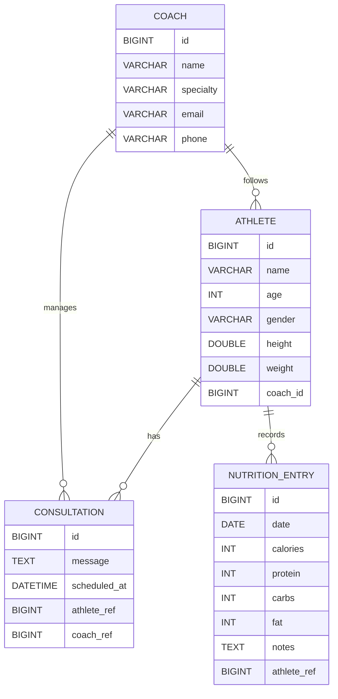

# 🏋️‍♀️ Olympic Nutrition Tracker

This is a **Spring Boot REST API** developed for the **Olympic Nutrition Tracker** project as part of **Bloc 3 – Studi 2025**.

The application manages athletes, coaches, consultations, and daily nutrition entries.
It includes CRUD operations, MySQL persistence, a basic authentication system, and JUnit service tests.

---

## 🚀 Features

* CRUD management for athletes
* CRUD management for coaches
* CRUD management for consultations
* CRUD management for nutrition entries
* Assign a coach to an athlete
* Track daily nutrition data: calories, protein, carbs, fat, notes
* MySQL database integration
* Basic authentication with Spring Security
* JUnit 5 tests for service layer
* API testing with Postman

---

## 🔐 Authentication

The backend uses **Spring Security Basic Auth** with demonstration accounts.

### Demo Accounts

| Username | Password | Role  |
| -------- | -------- | ----- |
| admin    | admin123 | ADMIN |
| coach    | coach123 | COACH |

Current authentication is used for demonstration purposes.
A future improvement is planned to implement a complete JWT authentication system with dynamic user management and role-based permissions.

Planned roles:

* **ADMIN**: full access to athletes, coaches, consultations, nutrition entries and user management.
* **COACH**: access to followed athletes, consultations and nutrition tracking.
* **ATHLETE**: limited access to personal data and consultations.

---

## 🛠️ Technologies Used

* Java 21
* Spring Boot 3.3.4
* Spring Web
* Spring Data JPA
* Spring Security
* MySQL
* Hibernate
* Jakarta Validation
* JUnit 5
* AssertJ
* Postman
* IntelliJ IDEA

---

## 🗂️ Project Structure

```text
src/main/java/com/eman/tracker/olympicnutritiontracker
│
├── config/
│   ├── SecurityConfig.java
│   ├── CorsConfig.java
│   └── OpenApiConfig.java
│
├── controller/
│   ├── AthleteController.java
│   ├── CoachController.java
│   ├── ConsultationController.java
│   └── NutritionEntryController.java
│
├── dto/
│   ├── ConsultationRequest.java
│   ├── ConsultationResponse.java
│   ├── NutritionEntryRequest.java
│   └── NutritionEntryResponse.java
│
├── exception/
│   ├── GlobalExceptionHandler.java
│   └── ResourceNotFoundException.java
│
├── mapper/
│   ├── AthleteMapper.java
│   ├── ConsultationMapper.java
│   └── NutritionEntryMapper.java
│
├── model/
│   ├── Athlete.java
│   ├── Coach.java
│   ├── Consultation.java
│   └── NutritionEntry.java
│
├── repository/
│   ├── AthleteRepository.java
│   ├── CoachRepository.java
│   ├── ConsultationRepository.java
│   └── NutritionEntryRepository.java
│
├── service/
│   ├── AthleteService.java
│   ├── CoachService.java
│   ├── ConsultationService.java
│   └── NutritionEntryService.java
│
└── OlympicNutritionTrackerApplication.java
```

---

## 🌐 API Endpoints

### Athletes

| Method | Endpoint                                           | Description                  |
| ------ | -------------------------------------------------- | ---------------------------- |
| GET    | `/api/athletes`                                    | Retrieve all athletes        |
| GET    | `/api/athletes/{id}`                               | Retrieve athlete by id       |
| POST   | `/api/athletes`                                    | Create a new athlete         |
| PUT    | `/api/athletes/{id}`                               | Update an athlete            |
| DELETE | `/api/athletes/{id}`                               | Delete an athlete            |
| PUT    | `/api/athletes/{athleteId}/assign-coach/{coachId}` | Assign a coach to an athlete |

### Coaches

| Method | Endpoint                          | Description                           |
| ------ | --------------------------------- | ------------------------------------- |
| GET    | `/api/coaches`                    | Retrieve all coaches                  |
| GET    | `/api/coaches/{id}`               | Retrieve coach by id                  |
| POST   | `/api/coaches`                    | Create a new coach                    |
| PUT    | `/api/coaches/{id}`               | Update a coach                        |
| DELETE | `/api/coaches/{id}`               | Delete a coach                        |
| GET    | `/api/coaches/{coachId}/athletes` | Retrieve athletes assigned to a coach |

### Consultations

| Method | Endpoint                  | Description                 |
| ------ | ------------------------- | --------------------------- |
| GET    | `/api/consultations`      | Retrieve all consultations  |
| GET    | `/api/consultations/{id}` | Retrieve consultation by id |
| POST   | `/api/consultations`      | Create a new consultation   |
| PUT    | `/api/consultations/{id}` | Update a consultation       |
| DELETE | `/api/consultations/{id}` | Delete a consultation       |

### Nutrition Entries

| Method | Endpoint                                       | Description                    |
| ------ | ---------------------------------------------- | ------------------------------ |
| GET    | `/api/nutrition-entries`                       | Retrieve all nutrition entries |
| GET    | `/api/nutrition-entries/{id}`                  | Retrieve nutrition entry by id |
| GET    | `/api/nutrition-entries?athleteId={athleteId}` | Retrieve entries by athlete    |
| POST   | `/api/nutrition-entries`                       | Create a nutrition entry       |
| PUT    | `/api/nutrition-entries/{id}`                  | Update a nutrition entry       |
| DELETE | `/api/nutrition-entries/{id}`                  | Delete a nutrition entry       |

---

## 📊 MySQL Database Structure

The project uses a relational MySQL database to store athletes, coaches, consultations and nutrition entries.
Foreign keys are used to ensure data consistency between tables.

---

### Table `athletes`

| Field    | Type      | Description               |
| -------- | --------- | ------------------------- |
| id       | BIGINT PK | Unique athlete identifier |
| name     | VARCHAR   | Athlete name              |
| age      | INT       | Athlete age               |
| gender   | VARCHAR   | Athlete gender            |
| height   | DOUBLE    | Height in cm              |
| weight   | DOUBLE    | Weight in kg              |
| coach_id | BIGINT FK | Assigned coach            |

Relations:

* One athlete can have many nutrition entries.
* One athlete can have many consultations.
* One athlete can be assigned to one coach.

---

### Table `coaches`

| Field     | Type         | Description             |
| --------- | ------------ | ----------------------- |
| id        | BIGINT PK    | Unique coach identifier |
| name      | VARCHAR(120) | Coach name              |
| specialty | VARCHAR(120) | Coach specialty         |
| email     | VARCHAR(160) | Coach email             |
| phone     | VARCHAR(40)  | Coach phone number      |

Relations:

* One coach can follow many athletes.
* One coach can be linked to many consultations.

---

### Table `consultations`

| Field        | Type      | Description                    |
| ------------ | --------- | ------------------------------ |
| id           | BIGINT PK | Unique consultation identifier |
| message      | TEXT      | Consultation message           |
| scheduled_at | DATETIME  | Scheduled date and time        |
| athlete_ref  | BIGINT FK | Related athlete                |
| coach_ref    | BIGINT FK | Related coach                  |

Relations:

* Many consultations can belong to one athlete.
* Many consultations can belong to one coach.

---

### Table `nutrition_entries`

| Field       | Type      | Description                       |
| ----------- | --------- | --------------------------------- |
| id          | BIGINT PK | Unique nutrition entry identifier |
| date        | DATE      | Nutrition tracking date           |
| calories    | INT       | Total calories                    |
| protein     | INT       | Protein in grams                  |
| carbs       | INT       | Carbs in grams                    |
| fat         | INT       | Fat in grams                      |
| notes       | TEXT      | Notes                             |
| athlete_ref | BIGINT FK | Related athlete                   |

Relations:

* Many nutrition entries can belong to one athlete.

---

## 🧠 Simplified Database Diagram



---

## ✅ JUnit Tests

JUnit 5 tests were implemented for the main service layer.

Tested services:

* `CoachService`
* `AthleteService`
* `NutritionEntryService`

Covered operations:

* Create
* Update
* Delete

All tests were executed successfully in IntelliJ IDEA.

Example test classes:

```text
src/test/java/com/eman/tracker/olympicnutritiontracker/CoachServiceTest.java
src/test/java/com/eman/tracker/olympicnutritiontracker/AthleteServiceTest.java
src/test/java/com/eman/tracker/olympicnutritiontracker/NutritionEntryServiceTest.java
```

Run tests:

```bash
mvn test
```

---

## 🏁 How to Run the Project

1. Clone the repository:

```bash
git clone https://github.com/eman-java-dev/OlympicNutritionTracker.git
```

2. Open the backend project in IntelliJ IDEA.

3. Configure MySQL database in `application.properties`.

4. Run the Spring Boot application:

```bash
mvn spring-boot:run
```

5. Access the API:

```text
http://localhost:8080/api/athletes
```

6. Access Swagger UI:

```text
http://localhost:8080/swagger-ui/index.html
```

---

## 📸 API Test Screenshots

Screenshots of API tests are stored in:

```text
screenshots/
```

Examples:

* Athletes CRUD
* Coaches CRUD
* Consultations CRUD
* Nutrition entries CRUD
* JUnit test results

---

## 🔮 Future Improvements

Planned improvements include:

* Implement JWT authentication.
* Add dynamic user registration and login.
* Add role-based access control for ADMIN, COACH and ATHLETE.
* Protect Angular routes with AuthGuard and RoleGuard.
* Add more integration tests.
* Add CI/CD with GitHub Actions.
* Improve monitoring and alerting.

---

## 👩‍💻 Author

**Eman Altohami**
Bachelor – Développeur Java, Studi 2025

GitHub Repository:
https://github.com/eman-java-dev/OlympicNutritionTracker

---

## 🧩 Note

This backend was built for educational purposes as part of **Bloc 3 – Projet Final Java Spring Boot** at Studi.
